# Компьютер РАДУГА
**Поэтапный процесс воссоздания схемы**

### 28.03.2019 Плата

Мне привезли нерабочую плату компьютера из Омска. На плате отсутсвует 13 микросхем, от которых остались только позолоченные выводы. Вероятно миросхемы кто-то сдал в драгмет. На плате имеется доработка, одна микросхема допаяна сверху. Также отсутсвуют многие дискретные компоненты, скорее всего конденсаторы или диоды. 

*Мои действия* 

Первым делом были выпаяны остатки выводов. Судя по всему, часть "золотых" микросхем была К533 или К1533 серии. Также очевидно, что часть из них - это адресный мультиплексор, а это упрощает срисовывание схемы. Хуже то, что при "выкусывании" микросхем были повреждены трассы, а также "выкушены" часть резисторов (видимо мешали обогащаться).

Лицевая сторона платы сильно подверглась окислению, видимо из-за агрессивного флюса который не был смыт. С обратной стороны использовалась канифоль, но в неприличных количествах и она не была смыта. 

"Ушло" грамм двести изопропанола и столько же растворителя 646 чтобы смыть все это. Но некоторые трассы под флюсом частично разрушились.

Теперь стало ясно, что это самая первая плата Радуги. Первые платы с завода были немного бракованые: переходные отверстия слишком малы, текстолит не слишком качественный, медь на нем держалась плохо, а трассы были слишком тонкие, включая трассы питания. Было решено платы доработать, а из этих собрать первый прототип для проверки. Первый прототип от конечной Радуги отличался, но сказать сейчас чем, не могу.

Другие недостатки платы:

- Дискретные элементы (резисторы, диоды, коденсаторы) запакованы в посадочное место DIP.
- Углы трасс 90 градусов.
- Часто трасса подходит к выводу сбоку (то есть сперва трасса идет в направлении между выводами и поравнявшись с выводом разворачивается на 90 градусов)

Все вышеперечисленное усложняет разводку, сборку и наладку.

## 29.03.2019 ПЗУ

Две из трех стоящих на плате ПЗУ были в панельках, но оказались муляжом. Несмотря на то, что одна из них 2764, на самом деле по трассам все три места места только под 2716 (573РФ5). 

Третье, запаяное ПЗУ имеет маркер карандашом "ЗН". Вероятно "знакогенератор" и это логично. Выпаять микросхему не удалось, выводы слишком плотно сидят в посадочных отверстиях, зазоры малы, можно сказать их вообще нет. 

Отрезав питание от микросхемы, подключив программатор к соседней панельке многократно считываю содержимое, данные постоянны и каждый раз совпадают. 

Однако сами данные "мусор". :(  

### 30.03.2019 Клавиатура (Дешифратор)

Для сканирования клавиатуры установлен 1555ИД3. Выходы которого через 13 диодов подключены к разъему. 

Входы дешифратора подключены к параллельному порту (1), а их в системе используется два, назовем их условно PPI1 и PPI2.

### 30.03.2019 ОЗУ

На плате установлены 16 микросхем 565РУ5 и 4 микросхемы 589АП16. Восемь из 16 микросхем также подключены к 589ИР12, выводы которой подключены к 155ИР1. Другие восемь микросхем имеют две 589ИР12 и также две 155ИР1. Схема очень похожа на "Специалист". Но в отличие от "Специалиста", входы и выходы данных у микросхем памяти замкнуты. Также замкнуты входы и выходы шинных формирователей, сделано это для упрощения трассировки.

Сигналы ~RAS и ~WE у всех микосхем объеденены, а вот ~CAS раздельные у каждого байта.

Дополнительная 589ИР12 имеет замкнутые входы и выходы, видимо это "копир" мы его еще называли "пересылочный регистр".

Вывод 6 у всех четырех сдвиговых регистров объединен, а вывод 9 у микросхем отвечающих за цвет соединен с землей. Вывод 8 у них подключен к 8,9 выводу регистров отвечающих за яркость точки.

*Звук*

Таймер ВИ53 генерирует три частоты, каждая имеет логарифмический ЦАП на 8 шагов. 

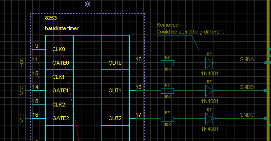

Микросхемы ЦАП отсуствуют, но полагаю стояли 533ИД10. У каждого дешифратора используется только три входа и 8 выходов. Резисторы сохранились и на них видны номиналы.

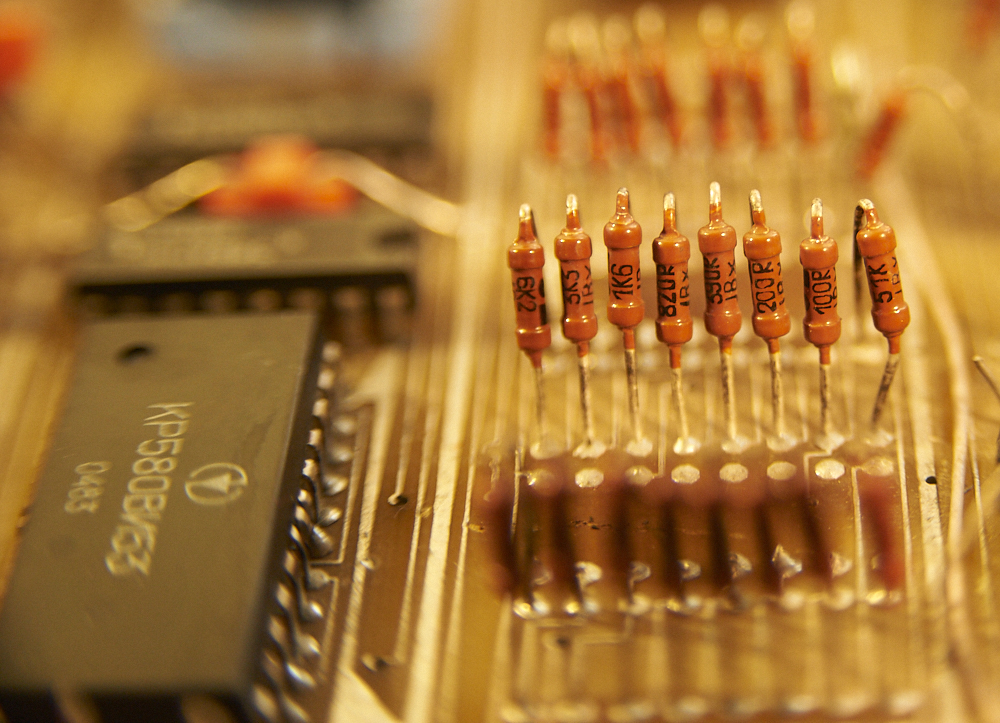

Получается примерно такая схема.

Я помню, что для минимизации были выбраны именно 8 шагов логарифмической шкалы. Шкалу нельзя назвать логарифмической, точнее она приближенная к логарифму. Номиналы резистора отличались примерно вдвое, но они подключались последовательно в цепь. Отступы от удвоенных значений были подобраны так, чтобы получался более-менее приемлемый результат при очень скромной схемотехнике.

Всего четыре канала ABCD, и четвертый используется для шума.

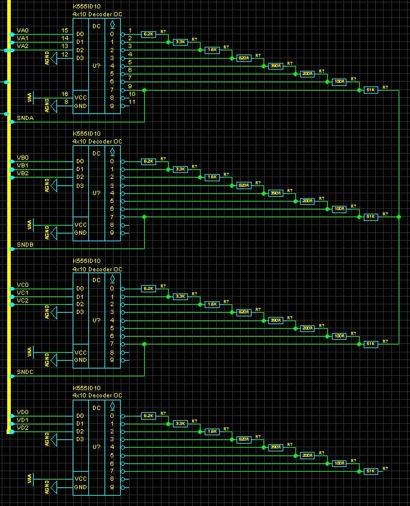

Входы дешифраторв ЦАП подключены к парралельным программируемым портам (1) и (2)

Максимальная громкость сигнала получается при значении на входе дешифратора 0, а минимальная при значении 7.
В результате получается следующая зависимость значения на входе дешифратора (по X) и значение нижнего плеча делителя (по Y).

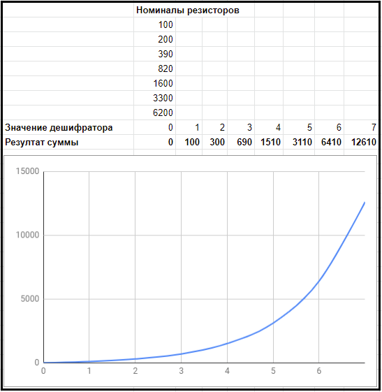

Помню в первых версиях плат был "шелест" и потрескивание в звуке при переходе громкости от одной к другой. Связано было с перезарядкой электролитической ёмкости в тракте. Затем проблему удалось устранить. 

Особенность схемотехники такова, что в случае программирования таймера на выдачу константной величины 1, система позволяла воспроизводить звук изменением лишь громкости. Это было сделано умышленно и заимствовано в PSG у MSX.

### 01.04.2019 COLORS

После регистров пиксел и цвета следует мультиплексор и одна из двух опций палитры. Теоретически мультиплексор формирут один из четырех вариантов цвета.

| COLSELECT | Результат |
|-----------|-----------|
| 0 | Младшая тетрада цвета из цветового буфера |
| 1 | Старшая тетрада цвета из цветового буфера |
| 2 | Цвет бордюра |
| 3 | Нулевой цвет |

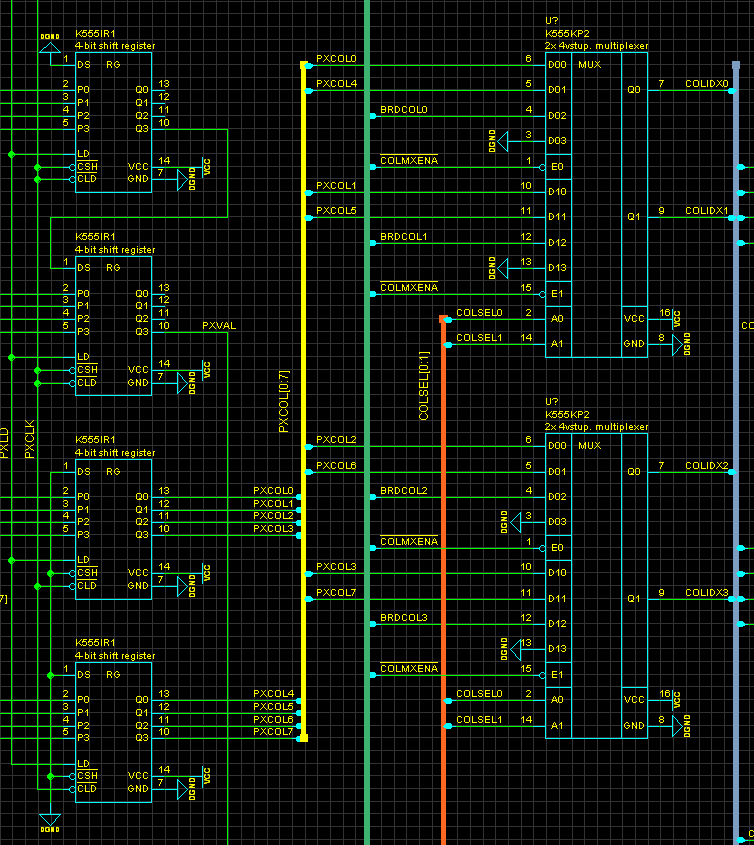

Цвет бордюра поступает от программируемого параллельного порта PPI 1. 

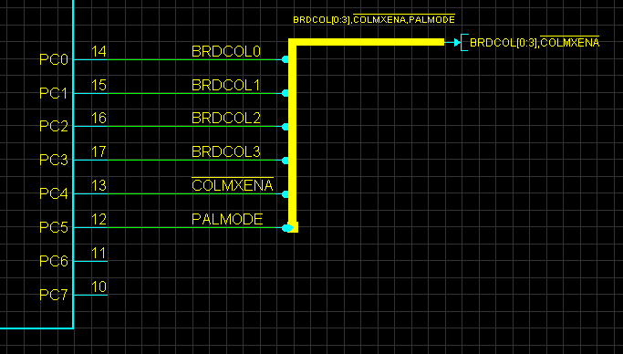

### 02.04.2019 УСИЛИТЕЛЬ ЗВУКА

Усилитель собран на половине 548УН1А, а выходной каскад на КТ814,КТ815. Большей части дискретных элементов усилителя на плате нет. Поэтому я нарисую заново схему усилителя. 

На второй половинке собран генератор шума для звуковой системы. Возможно используется КТ3102 с базой на общем, коллектором не подключенным и эмитером куда-то в операционнике.

### 02.04.2019 УСИЛИТЕЛЬ МАГНИТОФОНА

На этой плате он собран на 140УД6. Схема напоминает ту, что в СПЕЦИАЛИСТе, но есть и отличия. Однако опять, элементов в плате недостаточно чтобы повторить этот вариант. Я буду использовать вариант из СПЕЦАЛИСТа. Выход схемы подключен к PPI1.PB7

### 03.03.2019 Контроллер CRT

Немного продвинулась схема генератора синхросигналов. Во многом она повторяет схему от СПЕЦИАЛИСТ.

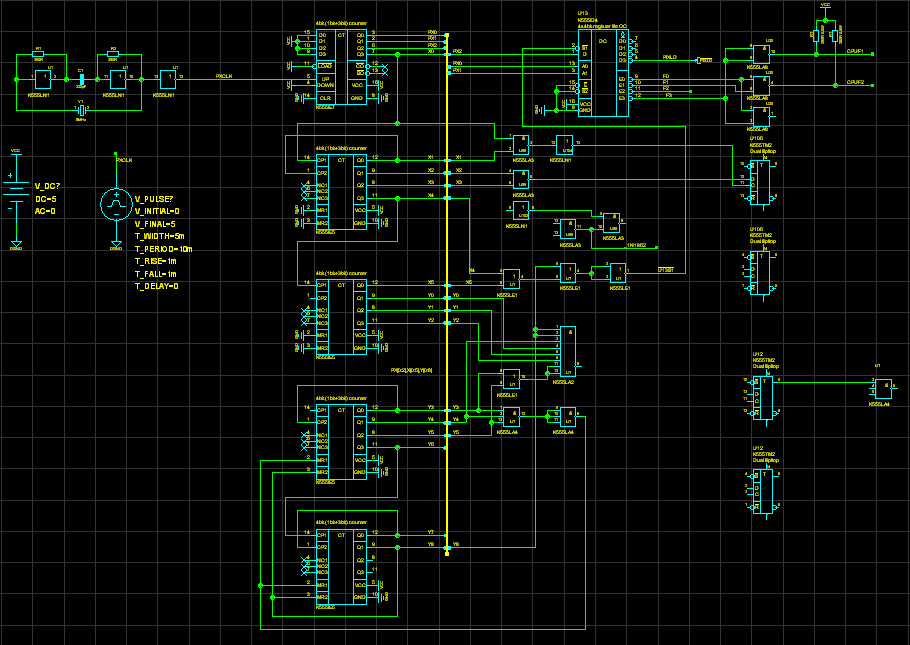

### 09.04.2019 Системный Разъем 

После небольшой паузы частично срисован разъем расширения. Судя по всему, кроме клавиатуры на разъем выведен параллельный интерфейс. Возможно принтер или универсальный порт расширения.

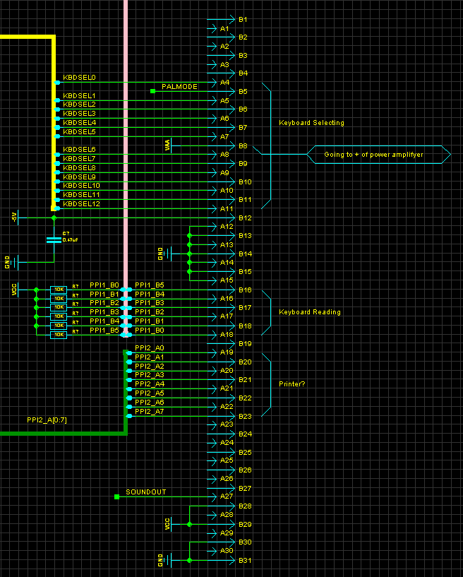

### 11.04.2019 Системный Разъем 

Два 8ми битных порта PPI2 подключены к разъему расширения. Это позволяет подключать различные периферийные устройства с программируемым интерфейсом: принтер, джойстик, covox, контроллер FD

Таким образом, функции PPI2 можно считать полностью понятными. Исключение в том, что не ясно как они использовались периферийным устройстом или внутри корпуса компьютера. Возможно, что на некоторых пинах был переключатель с задней панели, а возможно что на некоторых был подключен светодиод.

Функции PPI1 можно считать почти полностью понятными. Исключение PPI1.PB6, его назначение пока неизвестно.

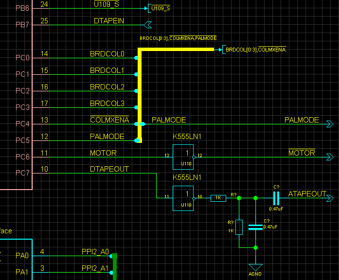

*Небольшое дополнение:* _Подключение выводов PPI1 и PPI2 к системному разьему не дает полной информации об их использовании внутри платы. Дальнейшее исследование может показать, что некоторые из этих выводов имеют какую-либо функцию внутри платы._ 

### 13.04.2019 Фонт попытка 2

Пока схема сканировалась нашлось интересное КЗ на адресной шине. А это могло привести к неверному чтению запаяного ПЗУ. Было принято решение выпять ПЗУ. Сперва лишний припой был удален, затем микросхема пропаяна сплавом Розе. Затем термофеном нагрета до 150 градусов, и она просто выпала из посадочного места.

Считывание данных показало другой результат (файл тут [ROM](../rom/rainbow-font.BIN)) 

Фонт выглядит так, как на следующем рисунке.

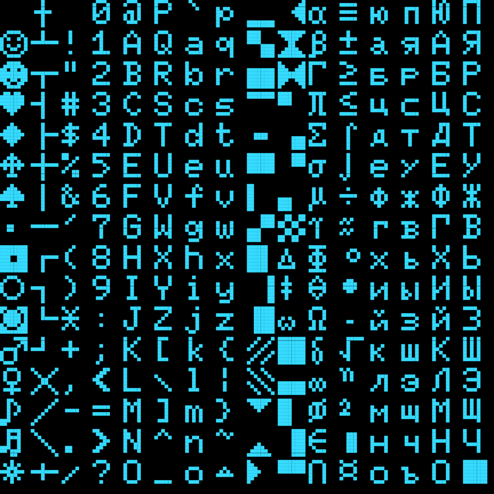

Размер символа 5x7 поэтому теоретически для монохромного экрана позволял отображать 64 символа в строке. К сожалению, заветных 80-ти символов не было, но и 64 лучше чем 48.

Невозможно утверждать, был ли этот фонт конечный, или использовался только в прототипе. Но даже если фонт изменился и стал 7х7 вряд ли изменилась кодировка. А кодировка должна соотвествовать кодировке в MSX.

### 13.04.2019 Бракованные DRAM 

В прототипе стоят микросхемы памяти с браком, старшая линия ROWS отсутсвует. Действительно, я помню что приходили и использовались микросхемы у которых было только половина памяти.

### 14.04.2019 Короткий отчет по прогрессу

- CRT контроллер срисован процентов на 99%
- CPU на 90%
- INT контроллер на 90%
- COPIER на 80%
- Peripheral & Sound на 99%
- DRAM & MUX на 99%

Очень приблизительно можно говрить о раскладке памяти.

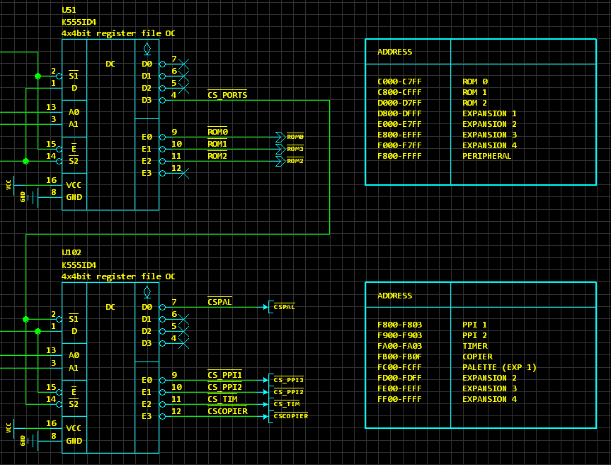

### 15.04.2019 COPIER

Сформировалась схема "копира", она довольно простая, но требовалось разобраться с сигналами которые она использует.

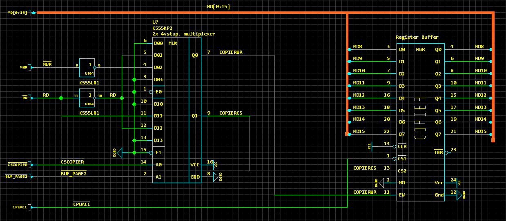

Вот так может выглядеть логика работы этой схемы.

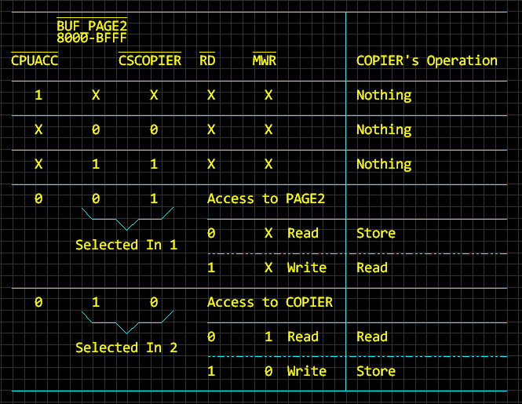

Иными словами, можно читать и писать по адресу копира FB00. 
Альтернативно можно считывая данные из страницы 2 (8000-BFFF) модифицировать "копир" цветом. Записывая в страницу 2 модифицировать буфер цвета содержимым копира.

Других режимов копира не видно, во всяком случае на этой плате. Думаю, что тоже самое могло быть и в конечном продукте.

## 18.04.2019 Первая альфа версия схемы

Ну вот и всё, первая версия схемы опубликована. Осталось найти и устранить ошибки. Затем перенумеровать REFDES и добавить в схему блокировочные конденсаторы.

[Schematic A2](../sch/raduga_computer_sch_a2.pdf)

## 20.04.2019 ЦАП горомкости и миксер (Диаграмма)

Смешивание вух каналов:

1) 1КГц (с огибающей громкости -1 на частоте 400Гц)
2) 5КГц (с огибающей громкости -1 на частоте 800Гц) 

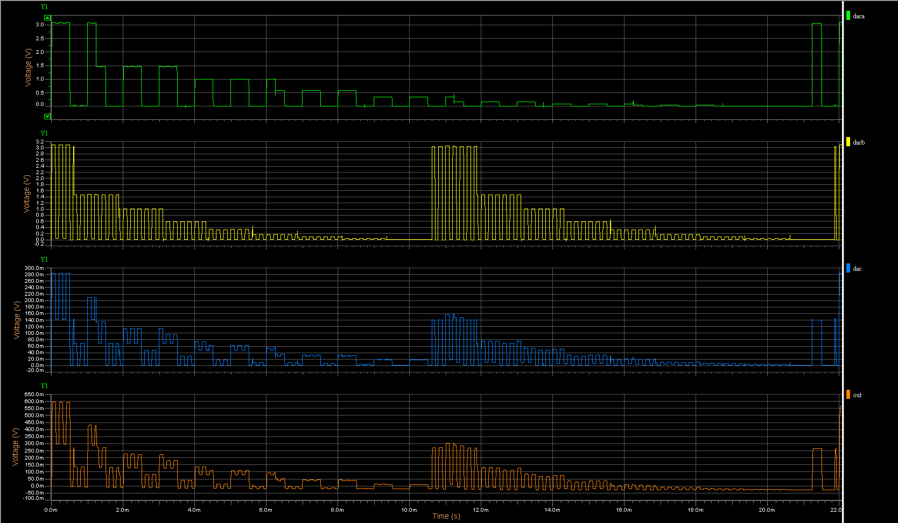
 
 Смешивание вух каналов:

1) 1КГц (с огибающей громкости -1 на частоте 400Гц)
2) 5КГц синусоиды которая имитирует шум (с огибающей громкости -1 на частоте 800Гц) 

 
## 20.04.2019 RGB ЦАП (Диаграмма)

Линейное нарастание яркости канала (8МГц) 

